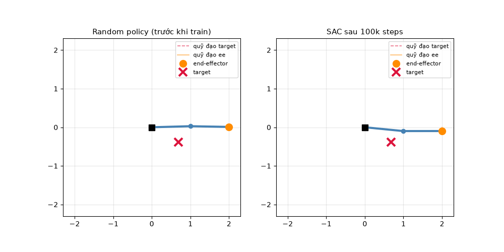
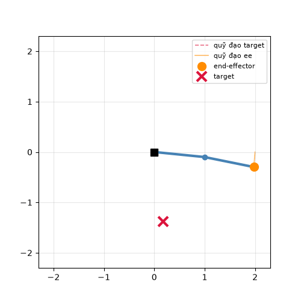
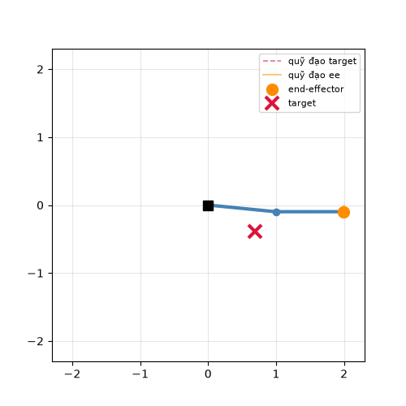
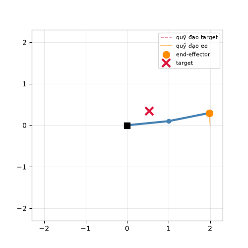
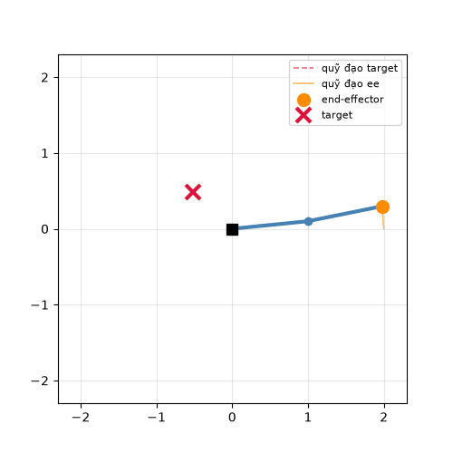
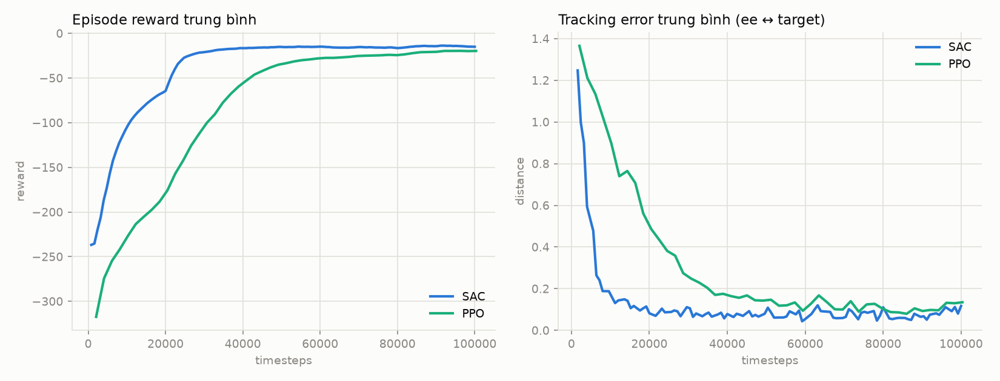
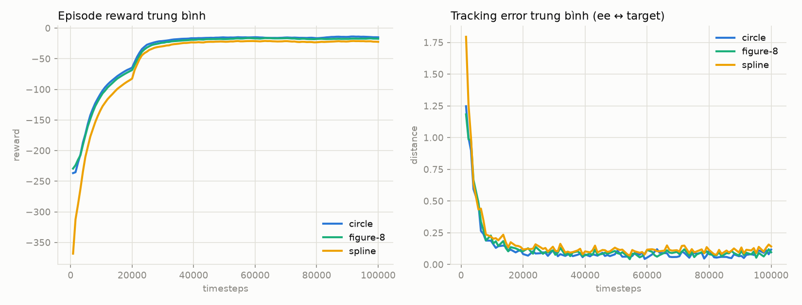
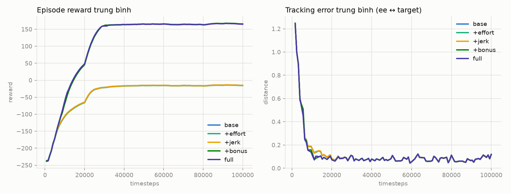

# Robot Arm 2D — Trajectory Tracking với Deep RL

Đồ án môn **Deep Reinforcement Learning**: huấn luyện tay máy 2 khớp phẳng
(2-link planar arm) học policy để end-effector **bám theo target** — từ điểm
cố định → đường tròn → hình số 8 → spline tự vẽ — bằng continuous control
(SAC & PPO, Stable-Baselines3) trên custom Gymnasium environment.



*Cùng episode, cùng seed: random policy (trái) đi lang thang — SAC sau 100k
steps (phải) bám khít đường tròn target. Đường đứt đỏ: quỹ đạo target,
đường cam: quỹ đạo end-effector thực tế.*

### Demo 4 loại target (SAC, cùng hyperparameters)

| Reaching điểm cố định | Circle |
|:---:|:---:|
|  |  |
| **Figure-8** | **Spline** |
|  |  |

📄 **Báo cáo đầy đủ (env, setup, kết quả, ablation): [REPORT.md](REPORT.md)**

## Điểm chính

- **Custom Gymnasium env** (`robot_arm/env.py`): API 5-tuple chuẩn, observation
  dùng `[cos θ, sin θ]` + vận tốc khớp + vị trí target + **error vector**
  (yếu tố then chốt để một policy bám được target di động bất kỳ).
- **Kinematic control**: action ∈ [−1, 1]², Δθ = action × 0.1 rad.
- **Reward tách term** (dist / effort / jerk / bonus), hệ số trong config,
  log riêng từng term vào `info` — có ablation chứng minh `−dist` là đủ.
- **4 chế độ target**: fixed / circle / figure-8 (Lissajous 1:2) / spline
  (Catmull-Rom khép kín qua control points tự vẽ), đều param theo thời gian t.
- **SAC vs PPO**: SAC sample-efficient hơn (~25–30k vs ~50–60k steps để hội tụ),
  PPO nhanh hơn ~11× wall-clock; chất lượng cuối tương đương.
- Pipeline reproducible: train qua SLURM, mỗi run 1 folder riêng
  (config + checkpoints + tensorboard + eval), pytest gate trước khi train.

## Kết quả tóm tắt

SAC, 100k timesteps, eval 20 episodes deterministic (chi tiết trong [REPORT.md](REPORT.md)):

| Task | Mean tracking error | Success rate (dist < 0.05) |
|---|---|---|
| Reaching điểm cố định | 0.120 | 86.9% |
| Circle | 0.067 | 90.6% |
| Figure-8 | 0.082 | 89.9% |
| Spline | 0.101 | 87.5% |





## Cấu trúc project

```
robot_arm/
├── kinematics.py      # forward kinematics 2-link
├── env.py             # RobotArm2DEnv (Gymnasium API)
├── trajectories.py    # circle / figure-8 / spline (Catmull-Rom)
└── render.py          # vẽ frame + xuất GIF/MP4
configs/               # toàn bộ hyperparameters (YAML) — sac, ppo, fig8, spline, ablation_*
train.py               # đọc config → train SAC/PPO → tensorboard + checkpoints
eval.py                # mean/max tracking error, success rate, video overlay
scripts/
├── submit_train.sh    # sbatch script (train qua SLURM)
└── plot_comparison.py # vẽ so sánh learning curves từ tensorboard
tests/test_env.py      # 22 tests: API, shape, reward, trajectories, rollout
```

## Cài đặt & chạy

```bash
python -m venv .venv && source .venv/bin/activate
pip install -r requirements.txt

# Test env trước khi train (bắt buộc)
pytest tests/ -q

# Train (trên cluster SLURM — script tự chạy pytest, fail thì abort)
sbatch --job-name=sac_circle scripts/submit_train.sh configs/sac_circle.yaml
# Hoặc train trực tiếp nếu máy local:
python train.py --config configs/sac_circle.yaml

# Đánh giá: metrics + video overlay
python eval.py --run-dir outputs/runs/<run>

# So sánh learning curves giữa các run
python scripts/plot_comparison.py \
    --runs outputs/runs/<run1> outputs/runs/<run2> \
    --labels SAC PPO --out outputs/comparison.png

# Theo dõi training
tensorboard --logdir outputs/runs/<run>/tb
```

Mỗi lần train tạo `outputs/runs/<run>/` chứa `config.yaml` (bản copy config đã
dùng), `checkpoints/`, `tb/` (tensorboard) và `eval/` (metrics + overlay.gif).

## Stack

Python 3.11 · gymnasium · stable-baselines3 · torch · matplotlib · pyyaml · pytest
